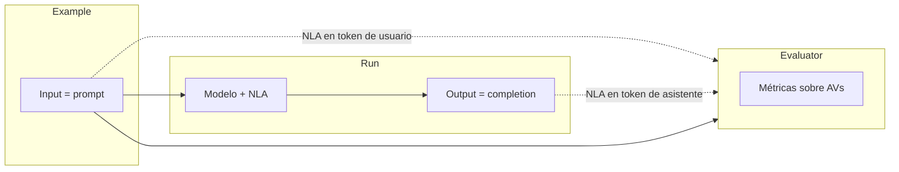
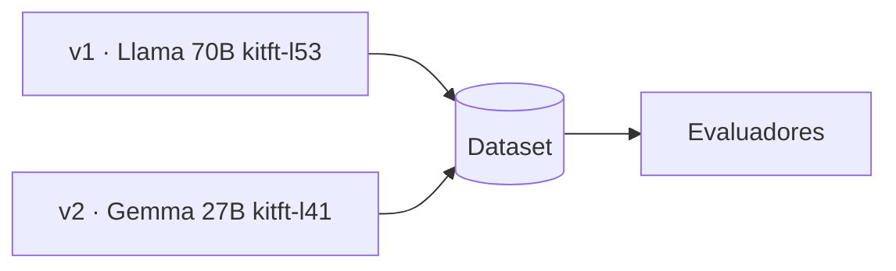
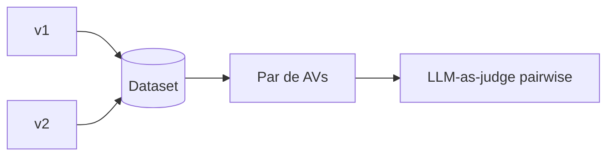

# Un marco de evaluación para Natural Language Autoencoders

**Versión ciega para CoNaIISI 2026 (trabajo estudiantil). Primera aproximación, ~5 páginas.**

Universidad Tecnológica Nacional

---

## Resumen

El presente trabajo busca un primer acercamiento a la evaluación sistemática de verbalizaciones de activación producidas por Natural Language Autoencoders (NLA). Un NLA comprime el vector de activación de un modelo de lenguaje en un texto breve y reconstruye ese vector a partir del texto. Ese texto, llamado Activation Verbalizer (AV), es un señalizador interpretable, no una lectura literal de las creencias del modelo. Las plataformas actuales, en particular Neuronpedia, permiten inspeccionar un chat y un token a la vez. No ofrecen un ciclo de experimento comparable al que LangSmith formalizó para las salidas de aplicaciones con inteligencia artificial. Anthropic ya aplica un LLM como juez sobre AVs en un estudio de awareness de evaluación, pero ese juez vive dentro de un paper, no como herramienta reutilizable sobre NLA públicos. Se propone NLA Eval, un marco y un prototipo que orquesta datasets de prompts, una política de tokens, llamadas a la API de Neuronpedia, evaluadores configurables (léxico y LLM-as-judge) y una vista de comparación de corridas. El objeto evaluado es el AV en una posición de token, no la respuesta pública del modelo. La validación empírica a escala y el acuerdo humano-juez sobre un corpus etiquetado se plantean como trabajo inmediato.

**Palabras clave:** Natural Language Autoencoders, interpretabilidad, LLM-as-judge, Neuronpedia, evaluación de modelos de lenguaje.

---

## 1. Introducción

Los modelos de lenguaje de gran escala (LLM) se evalúan, en la práctica industrial, sobre lo que dicen. Suites de prompts, métricas y jueces automáticos comparan respuestas, costos y tasas de error. Ese enfoque alcanza cuando el objeto de interés es la salida. Quiebra cuando el fenómeno vive en las activaciones internas y no aparece en el texto que el usuario lee.

Los Natural Language Autoencoders, introducidos por Fraser-Taliente y colaboradores en Transformer Circuits [1], atacan exactamente ese hueco. Un NLA es un autoencoder cuyo cuello de botella es texto en lenguaje natural. El Activation Verbalizer produce una verbalización. El Activation Reconstructor intenta recuperar el vector. El error de reconstrucción (MSE o RMSE) indica cuán leíble es esa verbalización, no si una frase aislada es “verdadera”.

Neuronpedia, en colaboración con Anthropic, hostea checkpoints públicos (por ejemplo Llama 3.3 70B con kitft-l53 y Gemma 3 27B con kitft-l41) y una API de `completion` y `explain` [2]. El producto es un microscopio. Un prompt, un modelo, una pestaña. Quien investiga un tema (un prior de foro, un riesgo, una awareness de evaluación) termina exportando capturas, eligiendo a mano el último token del usuario y el primero del asistente, y pegando verbalizaciones en otro chat para que un LLM “encuentre el patrón”. Ese flujo no es un experimento. Es artesanía.

En paralelo, el testing de aplicaciones no deterministas con IA ya tiene un marco de producto. LangSmith trata datasets, corridas, evaluadores (código o LLM-as-judge) y gráficos de comparación entre versiones de un flujo [3]. El objeto sigue siendo la salida de la aplicación.

El presente trabajo propone el análogo para NLA. No se inventa el LLM-as-judge sobre verbalizaciones. Anthropic lo usó para marcar awareness de evaluación no verbalizada, con un grader sobre 50 tokens de respuesta y un 97 % de acuerdo con los autores en 186 ítems [1]. Se cambia el objeto evaluado y se formaliza el ciclo que hoy falta en las herramientas abiertas. El resto del artículo se organiza así. La Sección 2 formula las motivaciones. La Sección 3 resume el modelo conceptual. La Sección 4 describe la arquitectura, que es el aporte central. La Sección 5 describe el prototipo. La Sección 6 diseña la validación. La Sección 7 discute limitaciones. La Sección 8 concluye.

---

## 2. Motivaciones

Tres tensiones justifican el marco.

Primero, la no determinidad. Un test clásico de API afirma “dado este input, el output es este”. Un NLA, como el LLM que explica, no se presta a esa igualdad. Hace falta una política fija de tokens, un juez con rúbrica, y tasas a lo largo de un dataset, no una captura.

Segundo, la escala. El límite de explain de Neuronpedia (del orden de 16 posiciones por pedido y un tope horario) convierte cada comparación Llama frente a Gemma en un trabajo de scripts y JSON. Sin un orquestador, el investigador elige el token “interesante” en cada corrida y destruye la comparabilidad.

Tercero, el vacío de producto. LangSmith no conoce capas, residuos ni MSE. Neuronpedia no conoce datasets, claves de feedback ni gráficos de hit rate. EasyNLA incluye jueces de unicidad o coherencia mientras se entrena un NLA [1]. Ese es otro trabajo. No puntúa hipótesis experimentales sobre AVs ya desplegados.

El motivo, en una frase, es este. Fomentar investigación *sobre* NLA, no el entrenamiento de NLA nuevos, sistematizando lo que hoy se hace a mano con capturas y un chat.

---

## 3. Modelo conceptual

El marco distingue cuatro objetos, en analogía deliberada con LangSmith.

| LangSmith | NLA Eval |
|---|---|
| Dataset de prompts | Igual. Cada ejemplo es un prompt y, opcional, una referencia para el juez |
| Target = aplicación o cadena | Target = `completion` más `explain` bajo una **política de tokens** |
| Output de texto | Artefacto = `{completion, AVs[], mse[], token}` |
| Claves de feedback | Booleanas (cumple o no), continuas (score min–max) o categóricas |
| Comparar experimentos | Dos corridas sobre el mismo dataset (modelo, política, juez) |

Una política de tokens, por defecto, replica el gesto que ya se usa en el laboratorio.

1. Último token de contenido del mensaje de usuario.
2. Primer token de la respuesta del asistente.

El investigador puede elegir una, la otra, o ambas. El MSE actúa como compuerta. Un AV con error alto no se lee como evidencia. Se reporta como verbalización poco reconstruible.

El juez no puntúa la creencia del modelo. Produce una señal interpretable. Si la rúbrica pide “tema de foro o comunidad”, un `true` no prueba que el preentrenamiento sea Reddit. Apoya una hipótesis que el output solo no mostraba, a validar con más tests [1].

Se distinguen tres tipos de evaluador.

1. **Léxico / código.** Subcadena (`reddit`, `forum`). Barato y honesto. No captura tema.
2. **LLM-as-judge, sin referencia.** Rúbrica Mustache sobre el AV (`{{nla}}`, `{{token}}`, `{{mse}}`). Boolean, score o categoría, más un campo opcional de razonamiento.
3. **Omisión (específico de NLA).** El tema está en el AV y no en la completion. Es el análogo del awareness verbalizado frente al medido por NLA en [1]. LangSmith no tiene este tipo como objeto de primer orden.

Un evaluador pairwise (cuál de dos AVs se prefiere) queda especificado en el diseño y no es el núcleo del prototipo actual.

---

## 4. Arquitectura

NLA Eval no entrena NLA. Orquesta APIs. La Figura 1 muestra el ciclo de una fila. El dataset aporta el *example* (input). El *run* produce la completion y las verbalizaciones en las posiciones elegidas. El evaluador consume input, AV de entrada, AV de salida y, si hace falta, la completion, y calcula métricas.

**Figura 1.** El evaluador no compara solo input contra output de la aplicación. Compara el ejemplo del dataset con las verbalizaciones NLA del token de entrada y del token de salida.

La Figura 2 muestra el uso que motiva el marco. Dos configuraciones (v1 y v2) recorren el mismo dataset. El panel de evaluadores resume tasas (por ejemplo hit rate de un juez booleano) para decidir si un modelo más barato o una política de tokens distinta cambia el señalizador interno.

**Figura 2.** Varias versiones de “aplicación NLA” (modelo, capa, política de tokens) sobre un único dataset. Los evaluadores agregan métricas por experimento.

### 4.1. Interfaz

La interfaz es un laboratorio web. Home de onboarding. Datasets. Evaluadores con configuración de feedback alineada a LangSmith (boolean, score, categórica, include reasoning). Corrida de experimento (fuente NLA, política, jueces). Tabla de filas con celdas coloreadas (cumple / no cumple, score, categoría) y gráficos de comparación. Las claves de OpenAI y Neuronpedia viajan en la sesión del navegador hacia un proxy. No se persisten en el cliente como secretos de producto.

### 4.2. Orquestador de experimento

El orquestador es el análogo del kernel de ARIA [4], con un trabajo más estrecho. No clasifica requerimientos. Secuencia, por cada ejemplo del dataset, tres pasos.

1. `POST /api/nla/completion` en Neuronpedia. Modelo e identificador de NLA (`kitft-l53`, `kitft-l41`, …).
2. Selección de posiciones según la política. `POST /api/nla/explain`.
3. Para cada evaluador, un LLM (u operación de código) sobre el artefacto. El esquema JSON de salida lo dictan las claves de feedback.

El orquestador persiste el experimento (filas, scores, comentarios, MSE) para que un `GET` posterior, en otro proceso, no pierda la corrida. En servidor local el almacén es un JSON. En despliegue el almacén debe ser compartido (por ejemplo Postgres). El filesystem efímero de una función serverless no es un laboratorio.

### 4.3. Capa NLA

Esta capa es un cliente. No reimplementa el autoencoder. Encapsula rate limits y el recorte de posiciones. Si explain falla, la fila queda con error y no se inventa un AV. El prototipo usa Llama 3.3 70B e instruct más Gemma 3 27B como contraste, no como par equivalente de claim científico.

### 4.4. Capa juez

Los prompts del juez son plantillas Mustache. El mapeo fija qué variable es el AV agregado, el AV de último token de usuario, el de primer token de asistente, el prompt, la completion, el token, el MSE o una referencia humana. El formato de respuesta (boolean, score con min y max, categorías con descripción) estructura el JSON. El razonamiento es opcional. El juez se aplica al AV, no a la respuesta pública, salvo que la rúbrica lo pida (omisión).

### 4.5. Capa de comparación

La tabla de un run copia el gesto de LangSmith. Columnas de input, referencia, output (el AV) y una columna por clave de feedback. Boolean se muestra como 1.00 o 0.00 con color. Score se colorea entre mínimo y máximo. Categórica muestra el nombre. El encabezado informa el promedio. La comparación de dos experimentos reusa las mismas claves sobre el mismo dataset. Un evaluador pairwise (Figura 3) queda como extensión. Dos AVs del mismo example, un juez de preferencia, `preferred ∈ {0, 1}`.

**Figura 3.** Evaluación pairwise (diseñada, no núcleo del prototipo). El juez elige entre dos verbalizaciones del mismo example.

---

## 5. Prototipo

Se materializó un prototipo web (Next.js) que implementa el ciclo de las Secciones 4.1 a 4.5 contra la API real de Neuronpedia y un juez OpenAI. El prototipo no es la contribución teórica. Es la prueba de que el marco cabe en un frontend más dos llamadas, como se anticipaba. Dataset semilla de prompts de consejo y how-to, juez de tema foro/comunidad, política de último token de usuario, tabla de filas y gráficos de hit rate y MSE medio.

No se reportan aquí tasas como hallazgo. Un prototipo de cuatro días no sustituye un protocolo de validación. Sí muestra que el cuello de botella deja de ser “cómo pego diez capturas” y pasa a ser “qué rúbrica y qué política de tokens son honestas”.

---

## 6. Diseño de validación

La validación se plantea en dos niveles, como en [4].

A nivel de **señal**. Un conjunto fijo de prompts (familia consejo, how-to, enciclopedia, un ítem en español). Dos fuentes NLA (Llama 70B kitft-l53 y Gemma 27B kitft-l41). Una política de tokens congelada. Un juez booleano de tema de foro y un evaluador léxico. Métricas: hit rate del juez, tasa léxica, tasa de omisión (AV sí, completion no), MSE medio. Acuerdo entre el juez y etiquetado humano sobre una muestra de AVs, en el espíritu del 97 % reportado en [1], sin copiar ese número.

A nivel de **herramienta**. Tiempo para reproducir una comparación que hoy exige pestañas. Capacidad de un tercero de definir un juez distinto (por ejemplo “peligro” o “evaluación”) sin tocar Neuronpedia. Usabilidad del laboratorio.

Los resultados de esa validación son el trabajo que este artículo deja explícitamente abierto, no un resultado adelantado.

---

## 7. Limitaciones

El marco hereda los límites del instrumento. El NLA se entrena en una capa fija. El AV es un señalizador. El juez puede sesgarse hacia lexemas o hacia el propio prompt. Neuronpedia impone cupos. El prototipo no cubre pairwise ni jueces de código más allá del léxico. No hay NLA públicos sobre modelos base, así que no se replica el eje base frente a SFT de otros papers de sesgo cultural [5]. Nada de esto autoriza a leer un AV como pensamiento.

---

## 8. Conclusiones y trabajos futuros

Se presentó un marco para evaluar verbalizaciones NLA con el mismo ciclo que LangSmith ofrece para salidas de aplicaciones con IA. El aporte no es un método nuevo de interpretabilidad. Es convertir la inspección puntual de Neuronpedia y el grader ocasional de Anthropic en un laboratorio con dataset, política de tokens, evaluadores y comparación de corridas. El prototipo muestra que la implementación es un orquestador sobre APIs existentes. La validación empírica, el acuerdo humano-juez y el evaluador pairwise son los pasos siguientes.

Neuronpedia fomentó el acceso a NLA. NLA Eval apunta a fomentar *investigaciones* que los usen, con una forma determinística de probar hipótesis sobre temas en AVs.

---

## Referencias

[1] K. Fraser-Taliente et al., “Natural Language Autoencoders,” Transformer Circuits, may. 2026. [Online]. Available: https://transformer-circuits.pub/2026/nla/

[2] Neuronpedia, “Natural Language Autoencoders demo and API.” [Online]. Available: https://www.neuronpedia.org/nla

[3] LangChain, “LangSmith: evaluation and experiment tracking for LLM applications.” [Online]. Available: https://docs.smith.langchain.com/

[4] P. Kozak Riehme et al., “ARIA: Un Enfoque Inteligente para la Gestión y Mejora de Requerimientos en Entornos Ágiles,” CoNaIISI, 2026.

[5] J. Fernandez de Landa et al., “Why are all LLMs Obsessed with Japanese Culture? On the Hidden Cultural and Regional Biases of LLMs,” Findings of EMNLP, 2026.

[6] Anthropic, “Natural Language Autoencoders,” 2026. [Online]. Available: https://www.anthropic.com/research/natural-language-autoencoders

[7] kitft, “natural_language_autoencoders,” GitHub. [Online]. Available: https://github.com/kitft/natural_language_autoencoders
